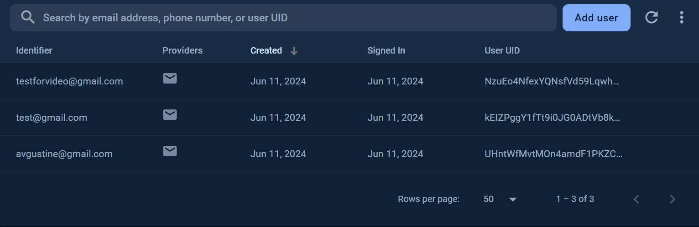

# Fancy Food app
- This is Food ordering app for final state.

# Assignment
0 Fancy Food is a fast-growing startup developing a mobile food ordering app.
The Fancy Food Mobile Development team consists of 7 people who are responsible for developing and supporting iOS and Android applications.
 
# Functions
- Login, Register, Basket, Choose catalog, Purchase, Add to basket, Delete from basket etc.
# Content
- name, logo, description, menu, photos, price, rate, add.
  
# Run
- To run this project first, create firebase auth, firestore, database then connect them with [firebase](https://console.firebase.google.com)
- Run gradle options, sync and run project.
  
# Screens

  
  
  
  
  
  
  
  
  
  
  

  

# Firebase Screens

    
    

    
# Tools 

- Firebase
- Kotlin
- MVVM
- Jetpack LifeCycle
- UI/UX libraries
- REST API
- Material Design
- UIKit
- Dagger/Hilt
- Room Database
  etc 
# Video

https://github.com/NPaugust/final-task/assets/72886935/9c81f845-af67-442b-ad6e-7d09c2d0bb37

# Credit
[Avgustine](https://github.com/NPaugust)

  
